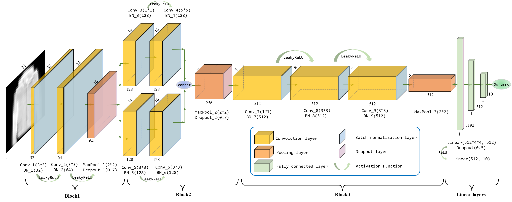
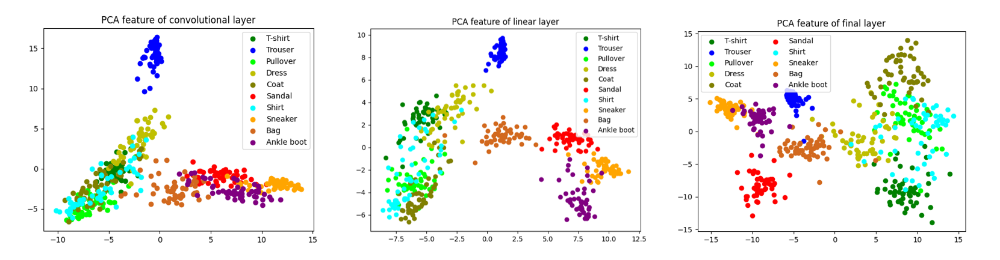
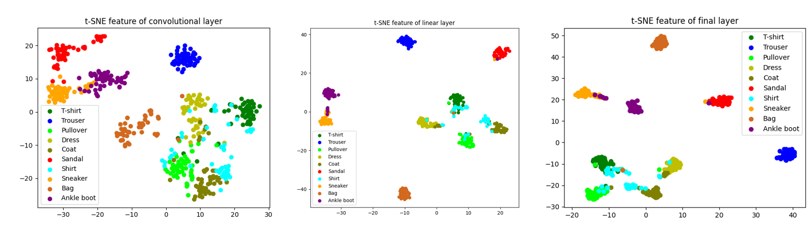
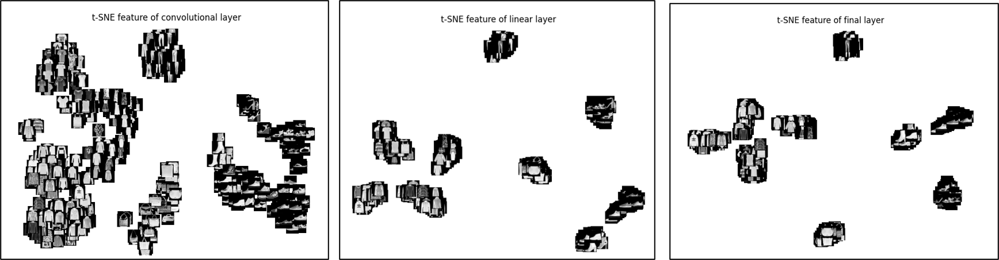

# Fashion-MNIST_Classification
Course project (mandatory task) of SJTU CS3612: Machine Learning, 2023 spring.

**Attention: Discussion & reference welcomed, but ***NO PLAGIARISM*** !!!**

### Task objective：
You should design one neural network by yourself. Specifically, each designed neural network should contain 12-35 layers, including convolutional layers, ReLU layers, Batch Normalization layers, fully connected layers, and maxpoolinglayers.
- You should not directly use classical neural networks (including but not limited to VGG-11/16/19, AlexNet, ResNet-18/24/32/36/44/56/102, DenseNet, GoogLeNet, and InceptionNet). Moreover,you should not design a new neural network by just adding or removing several layers from the above classical neural networks.
- You should train your designed neural networks on the dataset.
- You should use both PCA and t-SNE to visualize features on the designed neural network.

### Designed network architecture：


### Visualization：
- PCA

- t-SNE

- t-SNE with real image display


### Run codes：
- Reproduce the best accuracy on test set with pretrained weight
```
python main.py --eval
```
- Reproduce the whole training process with default parameterization
```
python main.py --train
```
- Show visualization results
```
python visualize.py
```

For further information, refer to Section 1 of the project report [here](report/Report_for_Machine_Learning_Project.pdf).

